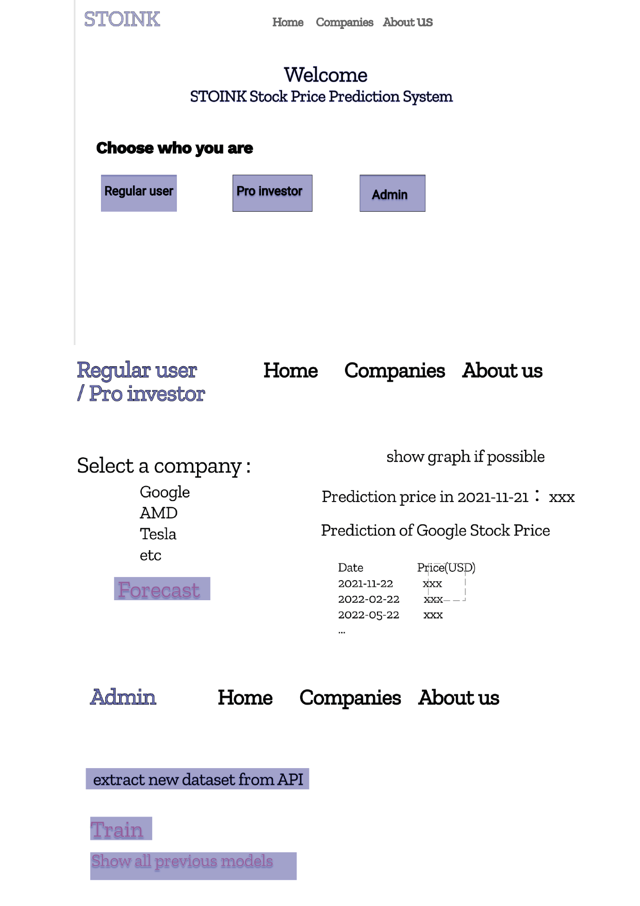

# Stoink

Stoink for Stock Price Prediction is a system that uses deep learning LSTM model to predict the price increase or decrease of one or more stocks for the next three months.

# Datasets used 
[AlphaVantage API](https://www.alphavantage.co/)

AlphaVantage provides data from fundamental data to technical indicators. The system is not only based the learning algorithm on the listing/opening/closing prices, but to go deeper by using the fundamental data provided by AlphaVantage. 
By using the fundamental data of companies we will be able to read data such as what assets the company has and their investments, their inventory and liabilities and the cash flow of the company and the earnings etc. 
The free API version is limited to 5 requests per minute and 500 total per day. 

# Libraries used 
 - Numpy 
 - Matplotlib
 - Tensorflow 
 - Keras 
 - Pandas
 - Scikit-learn 

# Technologies used 
 - Python
 - Django
 - LSTM

# Features 
TBA 
- Describe your ML pipeline, how the raw data is processed, what features to use
- Discuss how you addressed the aspects “data validation” and “model evaluation”
in your project.

# Setup
## Install Anaconda(Recommended)
- Install Anaconda that matches your system via [Anaconda webpage](https://www.anaconda.com/products/individual)
- Install ML packages either use Anaconda Navigator or conda via terminal: 

`(base)$ conda install numpy scipy matplotlib scikit-learn pandas `

## Install Django and SQLite
- Install pip3 via following command:
`(base)$ pip3 install django `

## Run server 
Ensure that you are in project directory and run the following command: 
`python manage.py runserver`

Open it with Chrome browser: http://127.0.0.1:8000/ 

# Functionality 
The client aims to present the option of using our model to predict what the increase or decrease in percentage is going to be of a certain stock or multiple stocks. This can be done in different ways, either the user inputs values manually and gets the prediction for those values or presses a button which runs all stocks in the system through the model and predicts which ones are predicted to have the most increase (the data which is ran through the model is the latest balance sheet report for each company). This is presented in a list, sorted in descending order. There will also be a list of stocks if the user just wants to make a prediction on a single stock, that is in the system. Admin can extract datasets from the API in the admin page to train the model with new data. 

# Mockup UI design 

# Screenshots 
TBA 

# Production system
TBA

# Project management 
[Project management](ProjectManagement.md)

